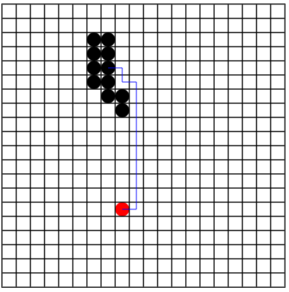

# PathFinder Snake Game
PathFinder Snake: Desenvolvido em Javascript esse código cria uma um caminho mais curto entre dois pontos. Utilizei esse treinamento como motivação para Interligência Artificial.

## Screendump

